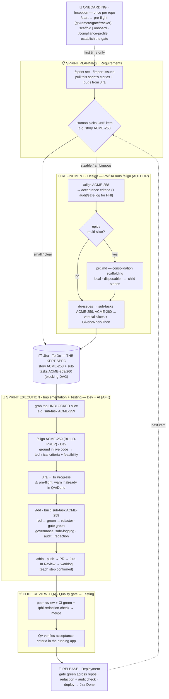

# Mindbowser Health Harness

> Mindbowser's discipline for building **healthcare products with AI agents** — a repeatable build loop
> plus healthcare-compliance guardrails, installed in every project, improved by everyone.
> **The discipline is agent-agnostic;** this repo packages it as Claude Code skills.

**What's a harness?** A safety rig — the gear that lets you move fast on dangerous terrain without
falling. That's the whole idea here.

**Why it matters in the AI era.** AI agents changed *how fast* code gets written — but not what makes
software *good*. The fundamentals haven't moved in 20+ years: tight **feedback loops**, **tests you
trust**, **small reversible steps**, **clear interfaces / deep modules**, and **human review where taste
lives**. Generating code faster doesn't suspend any of that — it *raises the stakes*, because an agent
produces broken work as fast as good work. The Mindbowser Health Harness doesn't invent a new process; it
**re-applies those timeless engineering fundamentals as a repeatable discipline**, so a team can move
*fast* with agents and *not fall*.

For Mindbowser, the terrain is **healthcare** — PHI, HIPAA, client IP, regulated data — so on top of the
build loop the harness adds the guardrails that make speed *safe*: compliance profiles, a redaction
check, audit + PHI-safe logging, and a deterministic "wall."

**It works with any AI coding agent** — the Build Loop, the gate, the slices, and the guardrails aren't
tied to one tool. Only the *packaging* is: this repo is a [Claude Code](https://claude.com/claude-code)
**plugin**, so the install steps, skills, and the wall hook are Claude Code mechanics. Install once, and
everyone on the repo gets the same skills (`/align`, `/tdd`, …) and the same standards.

## The Build Loop (the method)

| Phase | SDLC | Who | What |
|---|---|---|---|
| **1. Align** (e.g. `/align ACME-258`) | Requirements→Design | PM/BA + Dev | Relentless interview → a shared design concept + **acceptance criteria**. Two personas: **AUTHOR** (PM/BA, at refinement — business criteria) and **BUILD-PREP** (Dev, at pick-up — technical criteria + feasibility). Detects the item level (epic/story/bug) and **orchestrates phases 2–3 as sub-steps.** |
| **2. PRD** (`/to-prd`) | Design | *(orchestrated by `/align`)* | **Epics / large features only:** consolidate the alignment into a disposable `prd.md` to slice from (local, gitignored — Jira keeps the record). |
| **3. Slice** (`/to-issues`) | Design | *(orchestrated by `/align`)* | Break into **vertical slices** (schema→API→UI→tests) → Jira sub-tasks with blocking (e.g. `ACME-259`, `ACME-260`). |
| **4. Build (AFK)** (`/tdd`) | Implementation+Testing | Engineer + AI | Build the grabbed slice (e.g. sub-task `ACME-259`): pre-flight (warn if already in QA/Done) → *In Progress*; TDD red-green-refactor; gate green; governance; PR + worklog → *In Review*. |
| **5. QA** | Testing | QA + PM | Verify the acceptance criteria in the running app. Where human taste is imposed. |

**Operationally you touch just two verbs** — `/align <item>` (refine: criteria + slices pushed to Jira,
e.g. `/align ACME-258`) and `/tdd` (build the grabbed slice, e.g. sub-task `ACME-259`). PRD and slicing
are sub-steps `/align` runs, so nobody memorizes which command fits.
**The middle of the loop is invariant; the *front door* varies** — a new repo from MB boilerplate or an
existing codebase — and `/start` picks it for you. See `CONTEXT.md` and `COMMANDS.md`.

## How it flows (Agile ceremony → SDLC phase)

The harness **slots into the Scrum cadence you already run** — it doesn't replace it. A human picks the
*item*; **`/align` runs in two personas** — a PM/BA refines it (AUTHOR), a dev grounds it in code at
pick-up (BUILD-PREP) — and it pushes vertical slices to **Jira, the kept spec**. Devs grab the top
**unblocked** slice and build it with `/tdd`, which drives the ticket's lifecycle and logs time.
Governance and the wall run automatically throughout. (A consolidation `prd.md` is written only for
**epics / multi-slice features** — local, disposable scaffolding for slicing; the durable record is Jira.)



> **Reading it (left = Agile ceremony, right = SDLC phase):** onboard once → at planning pull the sprint
> and pick one item → a PM/BA `/align`s it (AUTHOR) into Jira criteria + slices → a dev `/align`s it again
> at pick-up (BUILD-PREP) for technical criteria + feasibility → builds unblocked slices with `/tdd`
> (ticket walks **To Do → In Progress → In Review**, worklog logged) → review + QA verify the criteria →
> release (→ **Done**). Small/clear items skip refinement and go straight to the board.
>
> **What to use, and where it lives:** you touch two verbs — **`/align`** (refine) and **`/tdd`** (build).
> `/to-prd` + `/to-issues` are sub-steps `/align` runs. **`align.md` / `prd.md` are local, disposable,
> gitignored** working notes under `.health-harness/sprints/` (a `prd.md` is written only for epics/large
> features) — **not** the source of truth. **Jira is the kept spec** the whole org reads: acceptance
> criteria on the story + the sliced sub-tasks. Rule of thumb: **refine in `/align`, read the truth in Jira.**
>
> **The wall runs across every lane:** push, PR, Jira writes, and a commit on the base branch all stop
> for your approval; catastrophic actions are blocked outright.

**Who runs which command, when?** The day-one reference — every command mapped to its Agile ceremony +
SDLC phase, who drives it, and what it produces — is in **`COMMANDS.md`**.

For the **full mental model** — the three planes (Intent → Design → Build), every role's lens (PM,
architect, engineer, QA, head of delivery, platform), clean architecture in the code *and* the process,
and how it scales to many teams/clients — see **`docs/delivery-mental-model.md`**.

## Non-negotiable principles

1. **Feedback loops are the quality ceiling.** No one-command gate → no good agent output.
2. **Vertical slices, never horizontal.** Demoable at every step.
3. **TDD is mandatory for AFK work.** It stops agents faking tests.
4. **Stay in the smart zone.** Small tasks; clear-and-loop over compacting; tiny system prompts.
5. **Own your planning stack.** Observability over the whole flow, not a black box.
6. **Deep modules.** Design interfaces, delegate implementations.
7. **Human QA is where taste lives.** Don't automate the idea, the QA, and the research all away.
8. **The harness is the healthcare differentiator.** Compliance, redaction, **audit-logging, and
   PHI-safe logging** aren't overhead — they're what let us ship fast *and* safely. For PHI work they're
   **authored as acceptance criteria at `/align` and verified in `/tdd`**. See `skills/compliance-profile`,
   `skills/phi-redaction-check`, `skills/safe-logging`, `skills/audit-logging`.

## The wall — enforced guardrails (not just instructions)

Installing the plugin installs a **PreToolUse hook** (`hooks/outward-guard.js`) that *deterministically*
gates tool calls — it's a wall, not a guideline the model might skip:

- **DENY** (hard block): force-push, `rm -rf /`/`~`, dropping/truncating tables, fork bombs, `mkfs`/`dd`
  to a device. The agent simply cannot run these.
- **ASK** (you must approve): `git push`, `gh pr create`/merge, `rm -rf`, `git reset --hard`, package
  publish, `docker push`, cloud/infra mutations (`kubectl/terraform/aws … apply|delete|deploy`), `curl`
  writes, **a `git commit` while you're on the base branch** (`main`/`master`/the configured `baseBranch`
  — branch first, or approve to commit on base), and **any external-system write via MCP** (Jira/Linear
  create/update/transition/comment).
- **DENY → agent self-corrects** (no human): a **malformed commit message**. The wall enforces a
  deterministic format so messages aren't guessed — a conventional `type(scope): subject` prefix (on by
  default) and, opt-in, a ticket key for traceability + the worklog signal. A bad message is blocked with the
  reason so the agent fixes and retries — you're never asked. Policy is `.health-harness/project.json`
  `commit` (`conventional`, `requireTicket`, `types`). On a customer repo, onboarding **respects a deliberate
  convention** (sets `commit.conventional:false` if they consistently use a different style) but **elevates the
  absence of one** — inconsistent/low-quality history keeps the gate on and is flagged as an improvement, not
  mirrored.
- **ASK → ship-without-a-passing-gate** (anti-hallucination): on `git push`, if the repo has a gate but there's
  **no captured PASSING gate run for this commit's sha**, the wall ASKs — a claimed-but-unproven "it's green"
  has no fingerprint, so you run the gate green or *consciously* approve an UNVERIFIED ship. No gate at all →
  ASK + flagged unverified (never a silent skip). NOT suppressed by the ship grant. (`bin/gate-evidence.js`.)
- **DENY → redaction egress gate** (no human): the **outbound content** of a text egress (a `gh pr`/`issue`
  body, a Jira/Linear MCP write) is scanned with the deterministic profile-driven scanner *before* it leaves.
  A **PHI/PII/secret literal** → hard-blocked with the offending **classes** (never the value) so the agent
  swaps in synthetic data and retries; a confirmed false positive is allow-listed once in `compliance.json`.
  Scanner error → fail-**closed** to ASK (never silently allows, never bricks shipping). This is a *backstop*
  for literal PHI — it does **not** catch code that *logs* PHI at runtime (that's safe-logging, enforced as
  project TDD tests). So redaction is now *enforced at egress*, not just a remembered `/ship` step.
- **DEFER** (untouched): reads, local/reversible work (a well-formed `git commit` on a feature branch,
  branch, tests, the scanner).

So every **outward** action — anything that leaves your machine or mutates a shared system — stops for
your approval, the catastrophic ones are blocked outright, commit messages are format-gated, and PHI/secret
literals are blocked at egress — all deterministically. Tested in `test/outward-guard.test.js`.

**One approval per publish, not one per step.** `/ship` shows a single **verbatim outbound preview** (PR
title+body, status from→to, the exact comment, the worklog + how it was derived); on your approval it sets a
short-TTL **grant** (`bin/ship-grant.js`) that makes the wall **stand down on the batch's outward ASKs** — so
you're not re-asked on push, then PR, then each Jira write. The grant only suppresses the *ASK* layer: a
catastrophic command or a PHI/secret in any payload is **still DENY'd**, grant or not.

## Judgment points — the agent governs, it doesn't gatekeep

The harness moves humans from *gatekeeping every step* to *governing at the moments that need a human's
values*. The agent decides the mechanical, reversible, inferable things itself and stops you **only** at a
**judgment point** — and only when the call is **irreversible** *and* **not inferable** (from the
alignment, PRD, or compliance profile) *and* **load-bearing now**. Fail any one of those and it just
proceeds (logging reversible low-stakes choices, batching deferrable ones into a single defaults digest at
QA). Foreseeable judgment calls are **front-loaded into `/align`**, where you're already deciding, so AFK
build stays quiet.

When the agent does stop, it's unmistakable: the reserved opener **`Your call —`**, the **axis** of the
decision (**Taste · Risk · Scope · Compliance** — shown as the header chip in an `AskUserQuestion` popup,
one per question), the cost of each side, and a recommendation. That opener appears **nowhere else** —
permission prompts stay terse and defaulted — so its scarcity is the signal to *stop and govern*. Full
contract in `CONTEXT.md` ("Judgment points").

## Sound cues (optional)

**Spoken voice** cues for lifecycle events — **Claude waiting** ("Your turn.", People), the **safety gate**
("Approval needed.", Integrity), **task done** ("Done.", Excellence), **sub-agent done** (Customer).
**ON by default** (voice); **disable per-person with `export MB_HARNESS_SOUNDS=off`** (or `=chime` for
tones). Plays **bundled spoken-voice clips** (`sounds/voice/`) via the OS audio player — real voice on
**every OS incl. Ubuntu, no TTS install**. Soft, never clinical-alarm-like. Swap in MB-recorded clips to
own the brand voice; details in `sounds/README.md`.

## Install once, globally (recommended)

Install at **user scope** so the harness is active in **every repo you open** — install once, never set it
up per-project again. Run these from anywhere (requires the `claude` CLI; `--scope user` is the default):

```bash
# 1. Register the harness marketplace (globally, for your user)
claude plugin marketplace add Mindbowser/health-harness

# 2. Install the plugin (globally)
claude plugin install health-harness@mindbowser
```

This writes your **user** settings (`~/.claude/settings.json`) — the marketplace source + the enabled
plugin. Installing brings **both the skills and the wall hook** (`hooks/outward-guard.js`, a `PreToolUse`
guard). They load at session start, so **restart Claude Code**, then verify:

```bash
claude plugin list                                 # → health-harness@mindbowser · Scope: user · enabled
claude plugin details health-harness@mindbowser    # → Skills (19) + a PreToolUse hook (the wall)
```

Open any repo and type **`/start`** — it detects new vs existing repo, runs the pre-flight, sets the
compliance profile (default `hipaa`), and routes you to the right front door. Or invoke skills directly:
`/align`, `/to-prd`, `/to-issues`, `/tdd`. Works on any stack; it won't rewrite your code.

**New to the harness?** Type **`/harness-help`** for a one-screen guide — it ships *in the plugin*, so it
works even if you don't have access to this repo.

**Updates are hands-off.** The marketplace is registered with **auto-update**, so the plugin self-updates
on startup; a SessionStart nudge tells you when a new version landed, and `/harness-update` bumps it on
demand. (Manual fallback: `claude plugin marketplace update mindbowser` then reinstall — `uninstall` +
`install` — which is more reliable than `claude plugin update`.)

### Other scopes (when you don't want it everywhere)
- **Pin it to a team repo** so everyone who clones gets it: add `--scope project` to both commands; this
  writes a committable `.claude/settings.json`. Use this for a shared repo where the harness is mandatory.
- **Personal trial in one repo:** `--scope local` writes the gitignored `.claude/settings.local.json`.

### Reinstall cleanly / move from project- to global-scope
If it's currently installed per-project and you want the global model:
```bash
claude plugin uninstall health-harness@mindbowser     # remove the existing install
claude plugin marketplace remove mindbowser           # drop the marketplace
# (optional) delete the plugin lines from that repo's .claude/settings.json so global is the only source
claude plugin marketplace add Mindbowser/health-harness   # re-add globally (user scope)
claude plugin install health-harness@mindbowser           # re-install globally
# then RESTART Claude Code and verify with `claude plugin list` (Scope: user)
```

> **Rolling this out to a team / the whole org, and keeping everyone current?** See **`docs/rollout.md`** —
> the GitHub-marketplace requirement for auto-update, per-repo vs MDM managed-settings install, and the
> exact config (with `docs/managed-settings.example.json`).

> Adding it to an existing/old repo specifically? The step-by-step one-pager is
> **`docs/add-to-existing-repo.md`**.

## Structure

```
.claude-plugin/              # plugin.json + marketplace.json (CLI discovery)
CLAUDE.md                    # org-wide agent instructions
CONTEXT.md                   # shared vocabulary — single source of truth for terms
docs/                        # guides: jira, rollout (+ managed-settings), authoring, multi-repo, mental-model
bin/redaction-scan.js        # the deterministic redaction scanner (+ test/)
bin/worklog-suggest.js       # suggests a Jira worklog time from git activity (+ test/)
bin/play-sound.js            # optional spoken-voice cues, on by default (+ test/)
bin/gen-sounds.js            # generates the cross-platform fallback chime .wav files
bin/session-context.js       # SessionStart hook — injects status + runs the daily coach (+ test/)
bin/usage-log.js             # metadata-only usage events → ~/.health-harness/usage/; `emit` CLI for hygiene signals (+ test/)
bin/issue-switch-nudge.js    # smart-zone reminder: UNRELATED new ticket in a heavy session → suggest a clean one (+ test/)
bin/issue-graph.js           # deterministic Jira relatedness (parent/epic/links) so related work keeps context (+ test/)
bin/usage-coach.js           # once-a-day (+ Monday weekly) principle-based coaching (+ test/)
bin/usage-upload.js          # ships the usage log to MBI Atlas — inline, time-boxed, chunked (+ test/)
bin/harness-stats.js         # /usage-style personal dashboard behind the /harness-stats skill (+ test/)
bin/preflight.js             # onboarding pre-flight (git/remote-reachable/gh-cli/gate/tracker/role/db-migration-layer) for /start (+ test/)
bin/jira-transitions.js      # infer + persist the Jira workflow transition map so /ship transitions by id, never guesses (+ test/)
bin/ship-grant.js            # short-TTL "user approved this publish batch" marker so the wall doesn't re-ask each step (+ test/)
bin/gate-evidence.js         # records real gate pass/fail per commit sha; wall blocks a hallucinated "it's green" at push (+ test/)
bin/slice-tests.js           # deterministic "did this slice add tests?" + per-ticket test/gate telemetry (+ test/)
bin/release.js               # `npm run release` — gate + push main + tag health-harness--v<version>
bin/boilerplate-registry.js  # resolve a tech stack → MB boilerplate repo (central registry) for /scaffold (+ test/)
sounds/                      # generated chimes; sounds/voice/ = bundled spoken-voice clips (opt-in)
hooks/                       # outward-guard.js (the wall) · sound cues · SessionStart · usage log (PostToolUse, UserPromptSubmit, PreCompact, SubagentStop)
skills/                      # one folder per skill (FLAT — Claude Code discovers skills/<name>/SKILL.md)
  start/                       # router: detect new vs existing → route to a front door
  scaffold-from-boilerplate/   # front door — new repo
  onboard-existing-codebase/   # front door — existing repo
  sprint/ import-issues/       # sprint container + pull tracker items
  align/ to-prd/ to-issues/ tdd/ ship/    # the Build Loop (ship = publish: push→PR→Jira→worklog)
  compliance-profile/ phi-redaction-check/ safe-logging/ audit-logging/   # healthcare governance
  role/                        # your persona (PM / engineer) — picks the /align mode
  writing-great-skills/        # the meta-skill: how to write skills here
  harness-help/                # in-plugin guide (/harness-help) — usable without repo access
  harness-update/              # one-step plugin update (/harness-update)
  harness-stats/               # your own usage dashboard (/harness-stats) — private, read-only
```

> **Skills are flat by design.** Claude Code discovers plugin skills at `skills/<name>/SKILL.md` (one
> level) — category subfolders are NOT scanned. We keep the grouping as labels above, not directories.

## Usage telemetry (metadata-only)

The harness logs **metadata-only** usage (event counts, no code/prompts/file-contents/PHI — enforced by a
write-time field allowlist) to `~/.health-harness/usage/` to power the daily coach, and ships that log to
**MBI Atlas** for org-level adoption analysis.

**It is ON by default** — the Atlas endpoint + ingest token are baked into `bin/usage-upload.js`, so devs
need **zero config**. Override or rotate via Claude Code settings `env` (FleetDM can push these as managed
settings), and **opt out** with `HARNESS_TELEMETRY_ENABLED=false`:

```jsonc
// .claude/settings.json (or managed settings) → "env"
{ "env": {
    "HARNESS_TELEMETRY_ENDPOINT": "https://…/atlas/api/harness/usage",  // override the baked-in default
    "HARNESS_TELEMETRY_TOKEN": "<rotated token>",
    "HARNESS_TELEMETRY_ENABLED": "false"                                 // ← opt out entirely
} }
```

`bin/usage-upload.js` runs on **SessionStart and turn-end (Stop)** — **inline but strictly time-boxed**
(≤2.5s budget; throttled to ~once/2h so the dashboard is never more than ~2h stale, even inside one long
session that's never restarted), backfilling any un-sent days and shipping only the new bytes of the current day in ≤32KB
**chunks** — so a large day ships in pieces (the byte-offset cursor advances per chunk) and no single POST
can outlive the timeout. Delivery is **at-least-once with no data loss**: the offset advances only after the
server 200s a chunk, and every record carries a stable `id` so a retried duplicate is dropped server-side.
Records also carry the git company email (`userId`) and harness version (`hv`); the server appends them to
`harness-telemetry/<email>/<date>.jsonl`. Identified employee telemetry should be backed by a written
monitoring policy (+ EU DPIA) — see `docs/usage-coaching-prd.md`.

**Smart-zone reminder.** When you bring an *unrelated* new ticket into a session already carrying a lot of
context, the harness shows a one-time nudge to start a clean session (better quality + cheaper turns — the
[smart zone](#non-negotiable-principles)). It's folded into the existing prompt hook (no per-turn cost) and
only triggers on a genuinely new ticket key past a context-size threshold. Tune with
`HARNESS_ISSUE_NUDGE_TOKENS` (default 40000 — cost-tuned for $20 plans; org can raise/lower via managed
settings) or disable with `HARNESS_ISSUE_NUDGE=off`.

## Contributing a skill

Read `skills/writing-great-skills/SKILL.md` first, then `docs/authoring.md`. Every skill is reviewed
against that meta-skill (checkable criteria, no duplication, explicit anti-patterns) and dog-fooded
once before merge.
