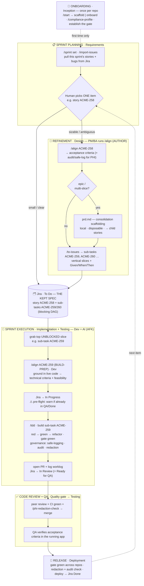

# Mindbowser Health Harness

> Mindbowser's discipline for building **healthcare products with AI agents** — a repeatable build loop
> plus healthcare-compliance guardrails, installed in every project, improved by everyone.
> **The discipline is agent-agnostic;** this repo packages it as Claude Code skills.

**What's a harness?** A safety rig — the gear that lets you move fast on dangerous terrain without
falling. That's the whole idea here.

**Why it matters in the AI era.** AI agents changed *how fast* code gets written — but not what makes
software *good*. The fundamentals haven't moved in 20+ years: tight **feedback loops**, **tests you
trust**, **small reversible steps**, **clear interfaces / deep modules**, and **human review where taste
lives**. Generating code faster doesn't suspend any of that — it *raises the stakes*, because an agent
produces broken work as fast as good work. The Mindbowser Health Harness doesn't invent a new process; it
**re-applies those timeless engineering fundamentals as a repeatable discipline**, so a team can move
*fast* with agents and *not fall*.

For Mindbowser, the terrain is **healthcare** — PHI, HIPAA, client IP, regulated data — so on top of the
build loop the harness adds the guardrails that make speed *safe*: compliance profiles, a redaction
check, audit + PHI-safe logging, and a deterministic "wall."

**It works with any AI coding agent** — the Build Loop, the gate, the slices, and the guardrails aren't
tied to one tool. Only the *packaging* is: this repo is a [Claude Code](https://claude.com/claude-code)
**plugin**, so the install steps, skills, and the wall hook are Claude Code mechanics. Install once, and
everyone on the repo gets the same skills (`/align`, `/tdd`, …) and the same standards.

## The Build Loop (the method)

| Phase | SDLC | Who | What |
|---|---|---|---|
| **1. Align** (e.g. `/align ACME-258`) | Requirements→Design | PM/BA + Dev | Relentless interview → a shared design concept + **acceptance criteria**. Two personas: **AUTHOR** (PM/BA, at refinement — business criteria) and **BUILD-PREP** (Dev, at pick-up — technical criteria + feasibility). Detects the item level (epic/story/bug) and **orchestrates phases 2–3 as sub-steps.** |
| **2. PRD** (`/to-prd`) | Design | *(orchestrated by `/align`)* | **Epics / large features only:** consolidate the alignment into a disposable `prd.md` to slice from (local, gitignored — Jira keeps the record). |
| **3. Slice** (`/to-issues`) | Design | *(orchestrated by `/align`)* | Break into **vertical slices** (schema→API→UI→tests) → Jira sub-tasks with blocking (e.g. `ACME-259`, `ACME-260`). |
| **4. Build (AFK)** (`/tdd`) | Implementation+Testing | Engineer + AI | Build the grabbed slice (e.g. sub-task `ACME-259`): pre-flight (warn if already in QA/Done) → *In Progress*; TDD red-green-refactor; gate green; governance; PR + worklog → *In Review*. |
| **5. QA** | Testing | QA + PM | Verify the acceptance criteria in the running app. Where human taste is imposed. |

**Operationally you touch just two verbs** — `/align <item>` (refine: criteria + slices pushed to Jira,
e.g. `/align ACME-258`) and `/tdd` (build the grabbed slice, e.g. sub-task `ACME-259`). PRD and slicing
are sub-steps `/align` runs, so nobody memorizes which command fits.
**The middle of the loop is invariant; the *front door* varies** — a new repo from MB boilerplate or an
existing codebase — and `/start` picks it for you. See `CONTEXT.md` and `COMMANDS.md`.

## How it flows (Agile ceremony → SDLC phase)

The harness **slots into the Scrum cadence you already run** — it doesn't replace it. A human picks the
*item*; **`/align` runs in two personas** — a PM/BA refines it (AUTHOR), a dev grounds it in code at
pick-up (BUILD-PREP) — and it pushes vertical slices to **Jira, the kept spec**. Devs grab the top
**unblocked** slice and build it with `/tdd`, which drives the ticket's lifecycle and logs time.
Governance and the wall run automatically throughout. (A consolidation `prd.md` is written only for
**epics / multi-slice features** — local, disposable scaffolding for slicing; the durable record is Jira.)



> **Reading it (left = Agile ceremony, right = SDLC phase):** onboard once → at planning pull the sprint
> and pick one item → a PM/BA `/align`s it (AUTHOR) into Jira criteria + slices → a dev `/align`s it again
> at pick-up (BUILD-PREP) for technical criteria + feasibility → builds unblocked slices with `/tdd`
> (ticket walks **To Do → In Progress → In Review**, worklog logged) → review + QA verify the criteria →
> release (→ **Done**). Small/clear items skip refinement and go straight to the board.
>
> **What to use, and where it lives:** you touch two verbs — **`/align`** (refine) and **`/tdd`** (build).
> `/to-prd` + `/to-issues` are sub-steps `/align` runs. **`align.md` / `prd.md` are local, disposable,
> gitignored** working notes under `.health-harness/sprints/` (a `prd.md` is written only for epics/large
> features) — **not** the source of truth. **Jira is the kept spec** the whole org reads: acceptance
> criteria on the story + the sliced sub-tasks. Rule of thumb: **refine in `/align`, read the truth in Jira.**
>
> **The wall runs across every lane:** push, PR, Jira writes, and a commit on the base branch all stop
> for your approval; catastrophic actions are blocked outright.

**Who runs which command, when?** The day-one reference — every command mapped to its Agile ceremony +
SDLC phase, who drives it, and what it produces — is in **`COMMANDS.md`**.

For the **full mental model** — the three planes (Intent → Design → Build), every role's lens (PM,
architect, engineer, QA, head of delivery, platform), clean architecture in the code *and* the process,
and how it scales to many teams/clients — see **`docs/delivery-mental-model.md`**.

## Non-negotiable principles

1. **Feedback loops are the quality ceiling.** No one-command gate → no good agent output.
2. **Vertical slices, never horizontal.** Demoable at every step.
3. **TDD is mandatory for AFK work.** It stops agents faking tests.
4. **Stay in the smart zone.** Small tasks; clear-and-loop over compacting; tiny system prompts.
5. **Own your planning stack.** Observability over the whole flow, not a black box.
6. **Deep modules.** Design interfaces, delegate implementations.
7. **Human QA is where taste lives.** Don't automate the idea, the QA, and the research all away.
8. **The harness is the healthcare differentiator.** Compliance, redaction, **audit-logging, and
   PHI-safe logging** aren't overhead — they're what let us ship fast *and* safely. For PHI work they're
   **authored as acceptance criteria at `/align` and verified in `/tdd`**. See `skills/compliance-profile`,
   `skills/phi-redaction-check`, `skills/safe-logging`, `skills/audit-logging`.

## The wall — enforced guardrails (not just instructions)

Installing the plugin installs a **PreToolUse hook** (`hooks/outward-guard.js`) that *deterministically*
gates tool calls — it's a wall, not a guideline the model might skip:

- **DENY** (hard block): force-push, `rm -rf /`/`~`, dropping/truncating tables, fork bombs, `mkfs`/`dd`
  to a device. The agent simply cannot run these.
- **ASK** (you must approve): `git push`, `gh pr create`/merge, `rm -rf`, `git reset --hard`, package
  publish, `docker push`, cloud/infra mutations (`kubectl/terraform/aws … apply|delete|deploy`), `curl`
  writes, **a `git commit` while you're on the base branch** (`main`/`master`/the configured `baseBranch`
  — branch first, or approve to commit on base), and **any external-system write via MCP** (Jira/Linear
  create/update/transition/comment).
- **DEFER** (untouched): reads, local/reversible work (`git commit` on a feature branch, branch, tests,
  the scanner).

So every **outward** action — anything that leaves your machine or mutates a shared system — stops for
your approval, and the catastrophic ones are blocked outright. Tested in `test/outward-guard.test.js`.

## Sound cues (optional)

**Spoken voice** cues for lifecycle events — **Claude waiting** ("Your turn.", People), the **safety gate**
("Approval needed.", Integrity), **task done** ("Done.", Excellence), **sub-agent done** (Customer).
**ON by default** (voice); **disable per-person with `export MB_HARNESS_SOUNDS=off`** (or `=chime` for
tones). Plays **bundled spoken-voice clips** (`sounds/voice/`) via the OS audio player — real voice on
**every OS incl. Ubuntu, no TTS install**. Soft, never clinical-alarm-like. Swap in MB-recorded clips to
own the brand voice; details in `sounds/README.md`.

## Install in your project (CLI)

Run these two commands **inside your project directory** (requires the `claude` CLI):

```bash
# 1. Register the harness marketplace for this repo
claude plugin marketplace add Mindbowser/health-harness --scope project

# 2. Install the plugin
claude plugin install health-harness@mindbowser --scope project
```

This writes `.claude/settings.json` (the marketplace source + the enabled plugin). **Commit that file**
— then everyone who clones the repo gets the harness automatically, no per-person setup. Installing the
plugin brings **both the skills and the wall hook** (`hooks/outward-guard.js`, a `PreToolUse` guard).
They load on the next session, so restart Claude Code (or run `/reload-plugins`), then verify:

```bash
claude plugin details health-harness@mindbowser   # → Skills (16) + a PreToolUse hook (the wall)
```

Now just type **`/start`** — it detects new vs existing repo, sets the compliance profile (default
`hipaa`), and routes you to the right front door. Or invoke skills directly: `/align`, `/to-prd`,
`/to-issues`, `/tdd`. Works on any stack; it won't rewrite your code.

**New to the harness?** Type **`/harness-help`** for a one-screen guide — it ships *in the plugin*, so it
works even if you don't have access to this repo.

**Updating later:** turn on **auto-update** so this is hands-off — `/plugin` → Marketplaces → `mindbowser`
→ enable auto-update (or enforce it org-wide via managed settings). To update by hand:
`claude plugin marketplace update mindbowser`, then **reinstall** (`uninstall` + `install`) — prefer
reinstall over `claude plugin update`, which is unreliable. **Personal trial only?** Use `--scope local`
instead of `--scope project` — it writes to the gitignored `.claude/settings.local.json`.

> **Rolling this out to a team / the whole org, and keeping everyone current?** See **`docs/rollout.md`** —
> the GitHub-marketplace requirement for auto-update, per-repo vs MDM managed-settings install, and the
> exact config (with `docs/managed-settings.example.json`).

> Adding it to an existing/old repo specifically? The step-by-step one-pager is
> **`docs/add-to-existing-repo.md`**.

## Structure

```
.claude-plugin/              # plugin.json + marketplace.json (CLI discovery)
CLAUDE.md                    # org-wide agent instructions
CONTEXT.md                   # shared vocabulary — single source of truth for terms
docs/                        # guides: jira, rollout (+ managed-settings), authoring, multi-repo, mental-model
bin/redaction-scan.js        # the deterministic redaction scanner (+ test/)
bin/worklog-suggest.js       # suggests a Jira worklog time from git activity (+ test/)
bin/play-sound.js            # optional spoken-voice cues, opt-in/silent by default (+ test/)
bin/gen-sounds.js            # generates the cross-platform fallback chime .wav files
sounds/                      # generated chimes; sounds/voice/ = bundled spoken-voice clips (opt-in)
hooks/                       # outward-guard.js (the wall) + sound cues (Notification/Stop/SubagentStop)
skills/                      # one folder per skill (FLAT — Claude Code discovers skills/<name>/SKILL.md)
  start/                       # router: detect new vs existing → route to a front door
  scaffold-from-boilerplate/   # front door — new repo
  onboard-existing-codebase/   # front door — existing repo
  sprint/ import-issues/       # sprint container + pull tracker items
  align/ to-prd/ to-issues/ tdd/          # the Build Loop
  compliance-profile/ phi-redaction-check/ safe-logging/ audit-logging/   # healthcare governance
  role/                        # your persona (PM / engineer) — picks the /align mode
  writing-great-skills/        # the meta-skill: how to write skills here
  harness-help/                # in-plugin guide (/harness-help) — usable without repo access
```

> **Skills are flat by design.** Claude Code discovers plugin skills at `skills/<name>/SKILL.md` (one
> level) — category subfolders are NOT scanned. We keep the grouping as labels above, not directories.

## Contributing a skill

Read `skills/writing-great-skills/SKILL.md` first, then `docs/authoring.md`. Every skill is reviewed
against that meta-skill (checkable criteria, no duplication, explicit anti-patterns) and dog-fooded
once before merge.
