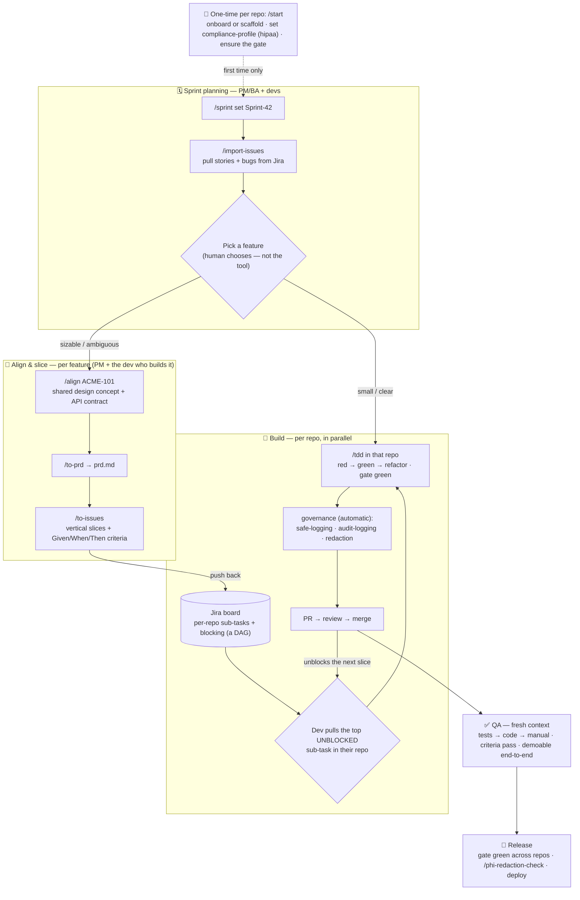

# MB Health Harness

> Mindbowser's discipline for building software *with* AI agents — packaged as Claude Code skills,
> installed in every project, improved by everyone.

A **harness** is a safety rig: it's what lets you move fast on dangerous terrain without falling.
That's the whole idea here. Shipping AI-built software in **healthcare** is dangerous terrain —
PHI, HIPAA, client IP, regulated data. The MB Health Harness is the set of guardrails + a repeatable
workflow that let a Mindbowser engineer move *fast* with agents and *not fall*: a tight feedback-loop
gate, compliance profiles, a redaction check, and a disciplined build loop.

This repo is a [Claude Code](https://claude.com/claude-code) **plugin**. Install it once and every
engineer gets the same skills (`/align`, `/to-prd`, `/to-issues`, `/tdd`, …) and the same standards.

## The Build Loop (the method)

| Phase | Who | What |
|---|---|---|
| **1. Align** (`/align`) | BA/PM + Dev | A relentless interview until everyone (and the agent) shares the design concept. Output is *alignment*, not a doc. |
| **2. PRD** (`/to-prd`) | BA/PM | Turn the alignment into a disposable destination doc. |
| **3. Slice** (`/to-issues`) | Dev/Tech-lead | Break it into **vertical slices** (schema→API→UI→tests), not horizontal layers. |
| **4. Build (AFK)** (`/tdd`) | Agent (Dev oversees) | TDD red-green-refactor, run the gate, loop until done. |
| **5. QA** | Dev + BA/PM | Fresh-context review + manual QA. Where human taste is imposed. |

**The middle of the loop is invariant; the *front door* varies** — a new repo from MB boilerplate, or
an existing codebase. `/start` picks the door for you. See `CONTEXT.md`.

## How it flows (sprint → release)

A human picks the story; `/align` works on that one feature; `/to-issues` pushes per-repo slices back to
the tracker; devs pull the top **unblocked** slice and build it with `/tdd`. Governance runs automatically.



> Reading it: **plan → pick a feature → align that one feature → slice into per-repo issues → devs grab
> unblocked slices → TDD-build → QA → release.** Small/clear tickets skip align and go straight to `/tdd`.

**Who runs which command, when?** The day-one reference — every command mapped to its Agile ceremony +
SDLC phase, who drives it, and what it produces — is in **`COMMANDS.md`**.

For the **full mental model** — the three planes (Intent → Design → Build), every role's lens (PM,
architect, engineer, QA, head of delivery, platform), clean architecture in the code *and* the process,
and how it scales to many teams/clients — see **`docs/delivery-mental-model.md`**.

## Non-negotiable principles

1. **Feedback loops are the quality ceiling.** No one-command gate → no good agent output.
2. **Vertical slices, never horizontal.** Demoable at every step.
3. **TDD is mandatory for AFK work.** It stops agents faking tests.
4. **Stay in the smart zone.** Small tasks; clear-and-loop over compacting; tiny system prompts.
5. **Own your planning stack.** Observability over the whole flow, not a black box.
6. **Deep modules.** Design interfaces, delegate implementations.
7. **Human QA is where taste lives.** Don't automate the idea, the QA, and the research all away.
8. **The harness is the healthcare differentiator.** Compliance + redaction guardrails are not
   overhead — they're what let us ship fast *and* safely. See `skills/governance/`.

## The wall — enforced guardrails (not just instructions)

Installing the plugin installs a **PreToolUse hook** (`hooks/outward-guard.js`) that *deterministically*
gates tool calls — it's a wall, not a guideline the model might skip:

- **DENY** (hard block): force-push, `rm -rf /`/`~`, dropping/truncating tables, fork bombs, `mkfs`/`dd`
  to a device. The agent simply cannot run these.
- **ASK** (you must approve): `git push`, `gh pr create`/merge, `rm -rf`, `git reset --hard`, package
  publish, `docker push`, cloud/infra mutations (`kubectl/terraform/aws … apply|delete|deploy`), `curl`
  writes, **a `git commit` while you're on the base branch** (`main`/`master`/the configured `baseBranch`
  — branch first, or approve to commit on base), and **any external-system write via MCP** (Jira/Linear
  create/update/transition/comment).
- **DEFER** (untouched): reads, local/reversible work (`git commit` on a feature branch, branch, tests,
  the scanner).

So every **outward** action — anything that leaves your machine or mutates a shared system — stops for
your approval, and the catastrophic ones are blocked outright. Tested in `test/outward-guard.test.js`.

## Install in your project (CLI)

Run these two commands **inside your project directory** (requires the `claude` CLI):

```bash
# 1. Register the harness marketplace for this repo
claude plugin marketplace add Mindbowser/health-harness --scope project

# 2. Install the plugin
claude plugin install health-harness@mindbowser --scope project
```

This writes `.claude/settings.json` (the marketplace source + the enabled plugin). **Commit that file**
— then everyone who clones the repo gets the harness automatically, no per-person setup. Skills load
on the next session, so restart Claude Code (or run `/reload-plugins`), then verify:

```bash
claude plugin details health-harness@mindbowser   # → Skills (11)
```

Now just type **`/start`** — it detects new vs existing repo, sets the compliance profile (default
`hipaa`), and routes you to the right front door. Or invoke skills directly: `/align`, `/to-prd`,
`/to-issues`, `/tdd`. Works on any stack; it won't rewrite your code.

**Updating later:** `claude plugin marketplace update mindbowser && claude plugin update health-harness`
(restart to apply). **Personal trial only?** Use `--scope local` instead of `--scope project` — it
writes to the gitignored `.claude/settings.local.json` and isn't shared with the team.

> Adding it to an existing/old repo specifically? The step-by-step one-pager is
> **`docs/add-to-existing-repo.md`**.

## Structure

```
.claude-plugin/              # plugin.json + marketplace.json (CLI discovery)
CLAUDE.md                    # org-wide agent instructions
CONTEXT.md                   # shared vocabulary — single source of truth for terms
docs/                        # authoring guide + the add-to-existing-repo one-pager
bin/redaction-scan.js        # the deterministic redaction scanner (+ test/)
bin/worklog-suggest.js       # suggests a Jira worklog time from git activity (+ test/)
hooks/                       # the wall — outward-guard.js PreToolUse hook (+ test/)
skills/                      # one folder per skill (FLAT — Claude Code discovers skills/<name>/SKILL.md)
  start/                       # router: detect new vs existing → route to a front door
  scaffold-from-boilerplate/   # front door — new repo
  onboard-existing-codebase/   # front door — existing repo
  align/ to-prd/ to-issues/ tdd/          # the Build Loop
  compliance-profile/ phi-redaction-check/ safe-logging/   # healthcare governance
  writing-great-skills/        # the meta-skill: how to write skills here
```

> **Skills are flat by design.** Claude Code discovers plugin skills at `skills/<name>/SKILL.md` (one
> level) — category subfolders are NOT scanned. We keep the grouping as labels above, not directories.

## Contributing a skill

Read `skills/writing-great-skills/SKILL.md` first, then `docs/authoring.md`. Every skill is reviewed
against that meta-skill (checkable criteria, no duplication, explicit anti-patterns) and dog-fooded
once before merge.

## Credit

The discipline is adapted from **Matt Pocock / AI Hero**'s harness-engineering work and his public
skills library ([`github.com/mattpocock/skills`](https://github.com/mattpocock/skills)). We fork the
*discipline*, not the library — the content, vocabulary, gates, and healthcare/PHI governance are
Mindbowser's. Thank you, Matt.
