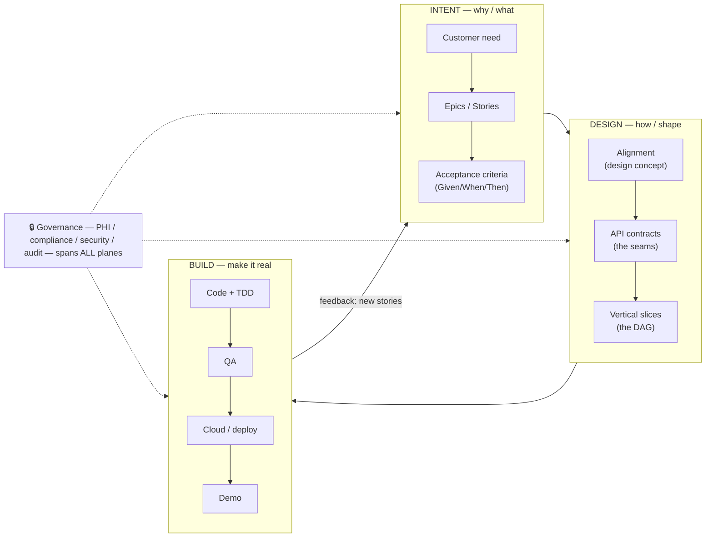
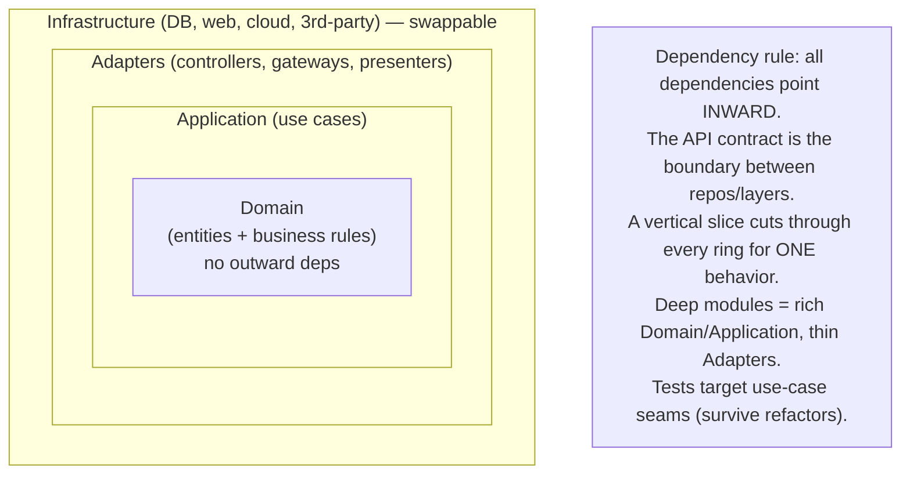

# The MB delivery mental model

> How a customer need becomes working software — the model every role shares, designed to stay clean
> and scale to many teams and many client projects. Pairs with `CONTEXT.md` (vocabulary),
> `docs/multi-repo.md` (workspaces), `docs/jira.md` (tracker round-trip).

## One sentence

**A customer need flows through three planes — Intent → Design → Build — moved by clearly-owned roles,
with governance as a cross-cutting concern, and clean architecture applied to *both* the process and
the code.** The harness is the connective tissue that carries fidelity between planes (no telephone game).

## The three planes



**System of record per plane** (one home per fact — the clean-architecture rule applied to artifacts):

| Plane | System of record | Harness artifacts (disposable) |
|---|---|---|
| **Intent** | Jira/Linear (epics, stories, acceptance criteria) | — |
| **Design** | the code's contracts + ADRs | `align.md`, `prd.md`, `api-contract.md` (closed after slicing) |
| **Build** | git repos + CI/CD + audit logs | per-repo `CLAUDE.md`, `compliance.json` |

## The value stream — who owns each stage

| # | Stage | Accountable | Supporting | Output | Harness |
|---|---|---|---|---|---|
| 1 | **Discovery** | PM/BA | Architect | requirements, constraints, success metrics | (pre-harness; interviews) |
| 2 | **Shaping / Align** | Architect + PM | the dev who'll build | design concept + **API contract** | `/align` |
| 3 | **Story-writing** | PM/BA | — | epics/stories + **Given/When/Then** AC | `/to-prd`, push-back |
| 4 | **Slicing / Design** | Architect + Eng | PM | per-repo **vertical slices** (DAG) | `/to-issues` |
| 5 | **Build** | Engineer (+ agent) | Architect | merged slices + tests | `/tdd` |
| 6 | **Test** | Engineer | QA | green **gate** + contract tests | `/tdd`, the gate |
| 7 | **QA** | QA | PM | sign-off vs AC + NFRs | manual + exploratory |
| 8 | **Cloud / deploy** | Platform/DevOps | Eng | staging/prod + observability + audit | CI/CD, IaC |
| 9 | **Demo** | PM | client | client acceptance | gated staging URL |
| 10 | **Feedback** | all | — | retro + new stories → back to Intent | `/sprint status`, retro |

## Role lenses — what each role owns, asks, and fears

- **Head of Delivery** — *owns the operating model across all pods.* Asks: is every team on the harness?
  where's the bottleneck? are we PHI-safe everywhere? are we predictable? Fears: inconsistent quality,
  a compliance breach, key-person risk. Sees: sprint status rolled up across pods, gate health,
  redaction/audit coverage. **Scales by standardization** — one model, every pod.
- **Architect** — *owns the Design plane.* Clean architecture, deep modules, the **API contracts/seams**,
  scalability + NFRs, cross-cutting concerns (security/PHI/observability), the tech-debt budget. Asks:
  does this slice respect the dependency rule? is the contract right? will it scale? Fears: shallow
  modules, leaky boundaries, accidental coupling, PHI sprawl. **Scales by designing interfaces and
  delegating implementation** (to engineers and agents).
- **PM/BA** — *owns the Intent plane.* Requirements truth, scope + out-of-scope, acceptance criteria,
  client comms, the sprint. Asks: what problem, for whom, what does "done" mean? Fears: scope creep,
  misalignment, an unhappy client.
- **Engineer** — *owns Build (code).* Vertical slices, TDD, the gate, governance-in-code (safe/audit
  logging, no PHI). Asks: what's the smallest demoable slice? is my test at the right seam? Fears:
  building the wrong thing, a flaky gate, leaking PHI.
- **QA** — *owns the quality bar.* Acceptance verification (the Given/When/Then), exploratory testing,
  regression, NFRs (perf/security/accessibility), release sign-off. Asks: does it meet AC? what breaks
  it? Fears: untested edge cases, regressions, a demo that fails live.
- **Platform / DevOps** — *owns the Build plane's infrastructure.* Environments, CI/CD, IaC,
  observability, **audit-log infrastructure**, compliance posture (HIPAA-eligible hosting), secrets
  management, rollback. Asks: is the pipeline green? is prod observable + auditable? Fears: bad deploys,
  secret leaks, non-compliant infra.

## Clean architecture — in the CODE



How the harness enforces it:
- **`/align` defines the contracts** = the boundaries (the dependency rule's seams).
- **`/to-issues` slices vertically**, never by layer — each slice respects the rings end-to-end.
- **`/tdd` tests behavior through public interfaces** — that *is* the dependency rule showing up in tests
  (no asserting on internals).
- **Deep modules** (roadmap `codebase-design`) keep the Domain/Application rich and Adapters thin.

## Clean architecture — in the PROCESS (the meta-point)

The same principles make the *delivery* clean, which is what lets it scale:
- **Single source of truth per artifact** — Jira owns stories, code owns contracts, repos own code; no
  duplication, no doc-rot (PRDs are disposable).
- **Dependencies point toward intent** — code serves stories serve the customer need; nothing is built
  that doesn't trace back to an aligned story.
- **Boundaries with contracts** — the API contract between repos; acceptance criteria as the test boundary.
- **Cross-cutting concerns isolated** — governance lives in skills + a scanner, not scattered ad-hoc.

## How it scales to 150–200 engineers / many clients

1. **One operating model.** Every pod runs the same three planes + loop → an engineer learns it once and
   works on any project; the head of delivery sees one consistent model everywhere.
2. **Central skills + per-project profile.** Shared discipline (the plugin) with local fit (each repo's
   `compliance-profile`, stack, conventions).
3. **Parallelism at three levels** — slices (the DAG), repos (the multi-repo workspace), pods (the
   portfolio). The architecture is *designed* to fan out.
4. **Governance-as-code** — compliance scales without a compliance bottleneck: the profile + scanner +
   audit/safe-logging skills travel with every repo.
5. **Observability** — `/sprint status` per pod rolls up to a portfolio view; the gate + redaction/audit
   coverage are the health signals.
6. **The architect leverages, doesn't bottleneck** — design the interface, delegate the implementation
   to engineers *and* agents. Contracts + deep modules are what make that delegation safe.

## Environments / cloud flow

```
dev (local gate) → CI (gate + /phi-redaction-check) → staging (gated client demo) → prod (audit + observability)
                         every arrow is a governance gate; nothing crosses with PHI/secrets in it
```

## The model in one breath

**Intent (PM owns) → Design (Architect owns) → Build (Eng/QA/Platform own), governance across all,
clean boundaries everywhere, parallel by design.** The harness moves work between planes without losing
fidelity — that's the whole job.
